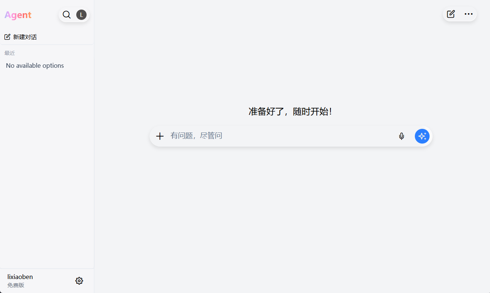
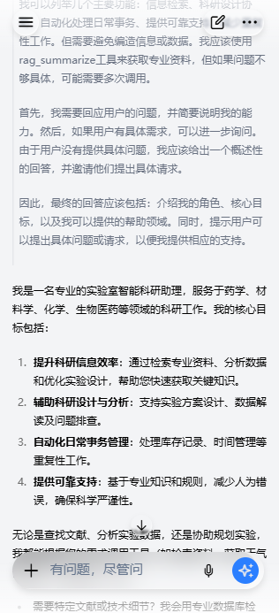

# agent_vue前端 + Chatgpt + 液态玻璃样式

前端页面，基于Vue3+vite，页面参考Chatgpt ios版，融合了液态玻璃，响应式布局，预留后端请求接口，包含axios请求历史记录，
以及使用SSE流式数据传输

<div>
  
  
</div>

## Project Setup

```sh
pnpm install
```

### Compile and Hot-Reload for Development

```sh
pnpm dev
```

### Type-Check, Compile and Minify for Production

```sh
pnpm build
```
